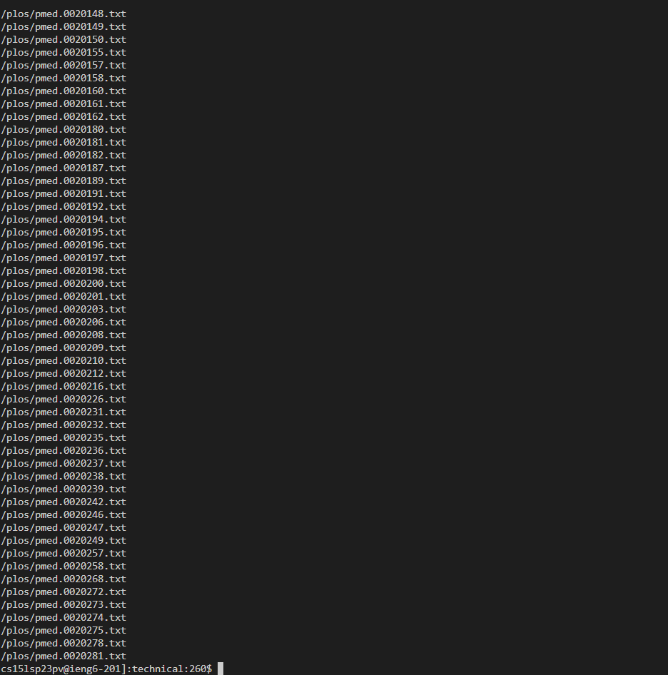
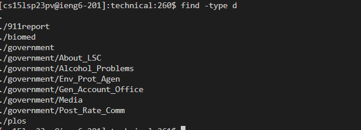
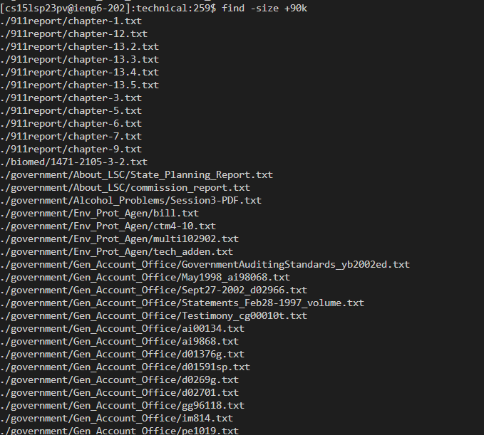

**Lab Report 5**
For this lab, I will be going over an exploration of the command `find` similar to lab report 3 where I researched the command line options for `grep`. 

**Command-line Options for find**
---

**1. find -name**
`find -name <pattern>`: Searches for files and directories with a specific name or pattern. For example, find -name "*.txt" will find all files ending with ".txt" in the specified directory.**

Here I typed in `find -name "*.txt"` in the technical directory, so it should print out all the files ending in .txt

We can see here that it printed out a bunch of files with the .txt in the end. There are more files that it printed out, but there were too many to be captured in the screenshot.

**2. find -type**
`find -type <type>`: Filters files by type. The <type> parameter can be f for regular files, d for directories, l for symbolic links, and more. For example, `find -type d` will find only directories in the specified directory.

For example, here I typed in `find -type d`. I expect it to print out only the directories under the techincal directory.

The output is exactly what I expected. It printed out the directories under the technical directory.

**3. find -size**

`find -size <size>`: Searches files based on their size. The <size> parameter can be specified in bytes, kilobytes (k), megabytes (M), gigabytes (G), etc. For example, `find -size +1M` will find files larger than 1 megabyte in the current directory.
  
For example, I typed in `find -size +90k`. I expect the output to print all the files that have size greater than 90 kilobytes.

**4. find -mtime**

`find -mtime <modified time>: Searches for files based on their modification time using the -mtime option. For example, `find -mtime -7` can find files modified in the last 7 days:

For example, here I put in `find -mtime -60`. I expect it to print out all the files that have been modified in the last 60 days.

[!Image](Screenshot 2023-06-07 112125.png)
  
We can see here that it printed out a bunch of files that have been modified in the last 60 days. There are more files that it printed out, but there were too many to be captured in the screenshot.

If I look for the files modified in the last 30 days with `find -mtime -30`. 
  
[!Image](Screenshot 2023-06-07 112626.png)

Here no files are printed because no files have been modified in the last 30 days. So we know that these files have been modified sometime between the last 30-60 days. 

That is it for our lab about some of the command-line options for `find`. I hope you learned some more about `find` from this tutorial!
